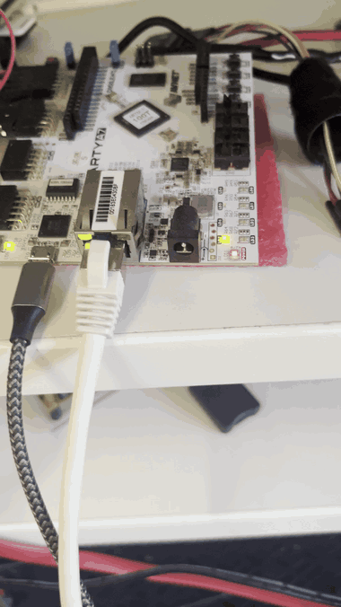
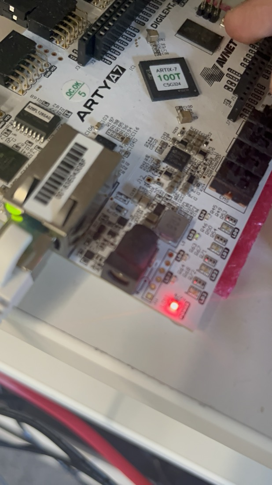

# fpga-net-parser

**Wire-speed Ethernet/IPv4/UDP header parser with a fixed-latency Level-1 trigger — SystemVerilog, one byte per clock.**

[](https://github.com/namangoyal-work/fpga-net-parser/actions/workflows/sim.yml)
[](LICENSE)
[](formal/)

A streaming packet filter built for the fast path: it validates MAC / IPv4 / UDP
headers as the bytes fly past — never stalling the wire — and emits a single
keep/discard verdict at a **constant** cycle offset. The same architecture powers
HFT market-data front ends, particle-physics L1 triggers, and line-rate security
appliances.

```
untrusted bytes ─▶ eth_parser ─▶ ipv4_parser ─▶ udp_parser ─▶ l1_trigger ─▶ verdict
  1 byte/clock       MAC,          IHL, running     ports,        fixed N       accept/
                     EtherType     checksum         length        cycles        reject
```

Every stage shares one 10-pin AXI-Stream interface, so stages compose without glue
and the pipeline is stateless between frames — which is what makes a fixed-latency
verdict possible.

## Results

Post-route on a Xilinx Artix-7 `xc7a100t-1` (slowest speed grade), running on a
Digilent Arty A7-100T.

| Metric | Value |
| --- | --- |
| Timing | **closes at 250 MHz** (WNS +0.446 ns; Fmax ≈ 281 MHz) |
| Area | **109 LUT · 149 FF · 0 BRAM · 0 DSP** (< 0.2 % of the device) |
| Throughput | 1 byte / clock, zero bubbles under backpressure |
| Latency | verdict at a constant `LATENCY` cycles after headers — **formally proven** |
| On hardware | verdict driven to an LED; a switch corrupts the port live to flip it |

Timing was closed by pipelining the checksum fold out of the trigger's critical
path (159 → 281 MHz); see [`docs/`](docs/) for the raw post-route reports.

## Demo

Running on the Arty A7-100T: `SW0` corrupts the UDP port on the wire, flipping the
verdict LED between accept and reject in real time.





## Verification

Correctness is machinery, not confidence — three independent layers:

- **Simulation** — 28 self-checking [cocotb](https://www.cocotb.org/) tests build
  real frames with [scapy](https://scapy.net/) and check every stage.
- **Adversarial fuzzing** — 300 valid / corrupted / random frames matched against a
  Python golden model: **zero bad-accepts, zero wedges** ([`tb/test_fuzz.py`](tb/test_fuzz.py)).
- **Formal proof** — SymbiYosys proves, by k-induction over *all* inputs, the
  skid-buffer AXI-Stream contract, the trigger's fixed-latency guarantee, and
  **no-bad-accept** (an accept requires every validation to have passed)
  ([`formal/`](formal/)).

Threat model, controls, and the evidence matrix live in [`SECURITY.md`](SECURITY.md).

## Quickstart

```bash
# Simulation (Icarus Verilog + cocotb)
python3 -m venv .venv && source .venv/bin/activate
pip install -r requirements.txt
make -C tb DUT=parser_top                                # end-to-end
make -C tb DUT=parser_top COCOTB_TEST_MODULES=test_fuzz  # fuzz campaign

# Formal proofs (OSS CAD Suite on PATH)
sby -f formal/axis_skid.sby
sby -f formal/l1_trigger.sby

# Synthesis + bitstream (Vivado)
vivado -mode batch -source synth/char.tcl               # timing/area characterization
vivado -mode batch -source synth/build_bitstream.tcl    # Arty A7-100T bitstream
```

## Layout

```
rtl/     synthesizable stages + parser_top + fpga_top board wrapper
tb/      cocotb testbenches (one per module) + adversarial fuzz
formal/  SymbiYosys proofs (.sby); assertions live in the RTL under `ifdef FORMAL
synth/   scripted Vivado flow: constraints (.xdc) + build/char/program TCL
docs/    post-route timing & utilization reports, bitstream
```

## Contributing

Contributions welcome — see [`CONTRIBUTING.md`](CONTRIBUTING.md). CI must stay green:
every push runs all testbenches, the fuzz campaign, and both formal proofs.

## License

MIT — see [`LICENSE`](LICENSE).
